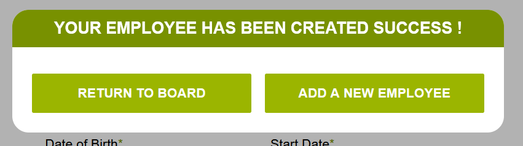

# Hrnet plugin modal

   
   
   

 

# Install your app React

## Install create-react-app globally
- npm install -g create-react-app

### Install your react app
- npx create-react-app project-name

# Install plugin modal
- Go your project folder, use command : cd project-name

## Original project whose has created this plugin
- https://github.com/DylanJana/Projet-14-wealth-health

## How to install plugin
- Go to https://www.npmjs.com/package/dylan-modal-hrnet
- Copy command : npm i dylan-modal-hrnet

## How to use plugin
- In your project page, import the modal with: 
    - import ModalHrnet from 'dylan-modal-hrnet/dist/ModalHrnet/ModalHrnet'

- Call this component like an other component react, with three arguments :
    - "openModal" is an boolean, when value is true, the modal has open, when value is false, the modal has closed
    - "onClose" is an function, when your clicking on "Return to board", your user navigate to board page
    - "resetForm" is an function, when your clicking on "Add a new employee" the form is reset, but datas are save

# Design of modal
 